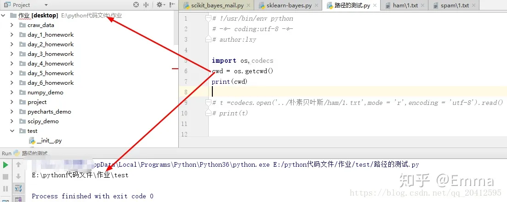
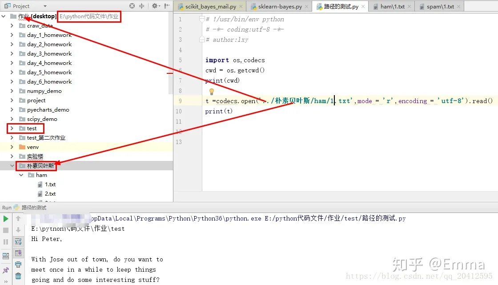

# 文件路径./和../
学习了 ”/ " . “ ./ “ .  ”../“的区别在此记录下

/ ：表示当前路径的根路径。

./ ：表示当前路径。

../ ：表示父级路径，当前路径所在的上一级路径。

举个栗子：

在读取文件时,路径的写法有如下方式

1. 文件在当前目录（以图像文件为例，当前项目文件为中心）

    - "./1.jpg" 或 "1.jpg"

2. 文件在上层目录

   - 在上层目录下

"../1.jpg"

   - 在上层目录下的一个Image文件夹下

"../Image/1.jpg"

   - 在上上层目录下

   - "../../1.jpg"

1. 文件在下一层目录(Image1文件夹)

   - "./Image1/1.jpg"

2. 根目录表示法,任何页面访问Image下的Image.jpg图片

   - "C:/Image/1.jpg"

代码示例：

做下测试：我们读取朴素贝叶斯文件夹下的文字内容， 如图所示：

