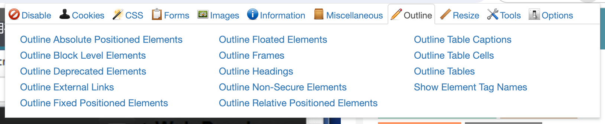
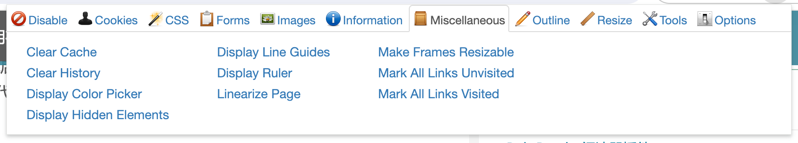

# Web Developer(扩展)-网页开发者必备工具
> 原文：[Web Developer-网页开发者必备工具](https://chromewu.com/web-developer.html)

Web Developer 这款扩展集成了各种各样的 Web 开发工具，是一个适用于**Chrome，Firefox 和 Opera** 浏览器的开发人员必备的浏览器实用工具，安装之后会在浏览器工具栏添加一个齿轮状的小图标，点击小图标之后就可以看到大量的 Web 开发工具。

它为大家提供了多种网页模块，使开发人员能够更方便地在工具背景对网页的 HTML、 CSS、脚本、多媒体、缓存、耳机等网页内容进行调试，让开发程序变得更加流畅

## Web Developer 插件功能介绍
Web Developer 插件工具栏主要由 **Disable、Cookies、CSS、Forms、Images、Information、Miscellaneous、Outline、Resize、Tools、View Source 和 Options** 等部分组成。

Web Developer 插件中的 Disable 工具可以对 JS 脚本、弹出窗口以及所有禁用选项进行禁用，Cookies 工具则支持在新窗口打开当前页面的所有 Cookie 信息，而且还可以对 Cookie 进行编辑、删除等操作。

Web Developer 插件的 CSS 样式表工具可以在新窗口查看网页 CSS，也可以禁用所有 CSS 样式。当然，它还可以编辑当前网页 CSS 文件，并且能够即时生效。

Forms 工具则可以提供 Form 表单一键清空表单所有字段、改变表单提交方式 post/get 相互转化、显示表单元素的属性值与密码、表单详细信息等等众多快捷易用的表单相关操作。

Web Developer 插件里的 Images 工具能够在标识出当前页所有图片或者在新窗口中显示当前页面所有图片信息，也可以对图片以及它们的 alt 属性进行禁用。Micellaneous 工具可以对缓存的快捷方式、历史记录进行清理，另外它也可以显示标尺，拥有即点即用的取色器，可以将所有链接以已访问 / 未访进行分类标记。

Web Developer 插件的 Outline 工具可以对块级元素、过时元素、悬浮元素、表格进行标识。Reisize 工具可以对窗口大小进行调节，也可以预览网页在各种设备上的响应式效果。Tools 工具拥有 CSS, HTML, 链接等各种校验器，而且还能查看网页源代码。有了这些功能，能够让大家的工作与学习变的更简单。

## Web Developer 插件使用方法
### 一、安装插件
如果有条件，可以直接在谷歌 Chrome 商店下载安装。如果无法访问 Chrome 商店，请在chrome插件屋下载 Web Developer 插件的安装包，解压后将 crx 文件安装到你的谷歌浏览器上。

### 二、Disable 工具
安装完成后，大家就可以看到浏览器工具，添加最新的一个形状的小图标，点击之以后就可以看到大量的 Web 开发工具。

在 Web Developer 插件里，可以选择Disable 工具，然后直接鼠标左键单击选择是否对当前页面中的缓存、Mete 定向、JavaScript 脚本、弹出窗口等功能进行屏蔽操作。

### 三、Cookies 工具
选定 Cookie 工具，我们可以鼠标左键单击直接对 Cookie 进行自定义，大家也可以点击相应的功能按钮根据不同的域名或路径对当前页面的 Cookie 信息进行查看，而且大家还可以对 Cookie 进行编辑、删除等操作。

### 四、CSS 样式表工具
对 CSS 样式表工具选定后，可以直接点击相应的功能，对网页所有 CSS 样式进行编辑，或是直接在新窗口查看网页 CSS，也可以对页面的 css 文件进行实时编辑。当然，大家还可以通过相应的功能按钮后在窗口中查看立即反应浏览后的效果。

### 五、Forms 工具

在 Web Developer 插件里选择 Forms 工具后，同样可以使用鼠标左键进行一键清空表单所有字段、改变表单提交方式 post/get 相互转化，显示密码或表单元素的属性值，表单详细信息等简便易用的表单操作。

### 六、Images 工具

选择 Images 工具后，还是可以直接单击鼠标左键显示当前页面所有图片，或者是对所有图片进行禁用。另外，大家也可以查看在新窗口中显示当前页面所有图片的宽度、高度、alt 等属性信息。

### 七、Infomation 工具

打开 Infomation 工具后，大家可以鼠标点击相应功能后就可以直接在网页中显示 href 属性值，也可以显示网页中任何元素的属性以及对网页中所有颜色的详细信息、网页 JS 源代码、网页响应头信息进行显示。当然，它也可以为大家找出所有重复的 id。

### 八、Micellaneous 工具

大家可以直接对 Micellaneous 工具进行点击，接着再点击相应的功能按钮对快捷方式、历史记录进行清理。另外，大家也可以对隐藏元素、标尺进行显示，或者对即点即用的取色器进行使用。更值得一提的是，大家还可以对将所有链接进行已访问 / 未访问分类标记。

### 九、Outline 工具
打开 Outline 工具，可以点击相应的功能按钮对绝对定位的元素、标识块级元素、过时元素、固定的元素等内容进行标识。

### 十、Reisize 工具

使用 Reisize 工具可以对窗口大小进行调节，其中还可以对网页在各种设备上的响应式效果进行预览。

### 十一、Tools 工具

大家可以使用 Tools 工具拥有 CSS, HTML, 链接等各种校验器，大家还可以直接点击相应功能按钮后查看网页源代码。

